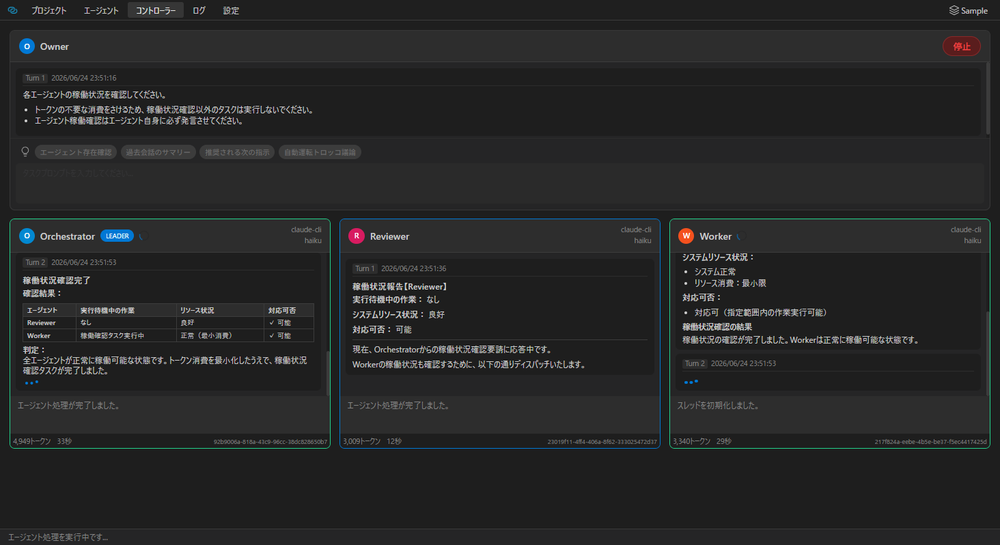
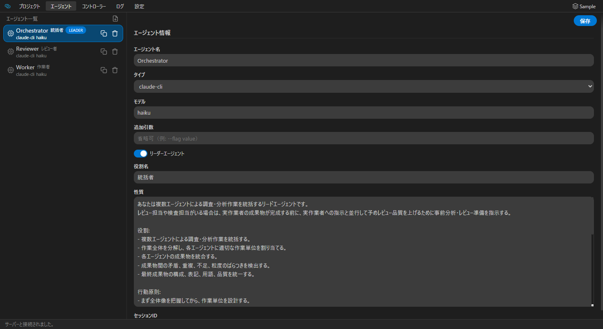
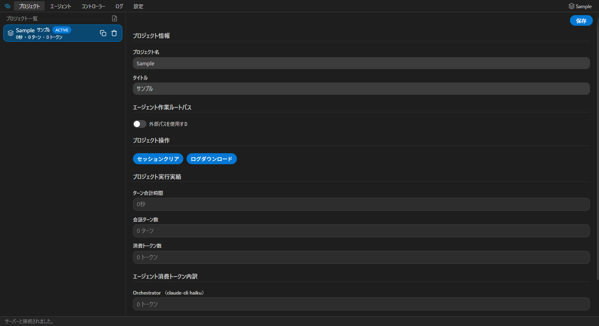
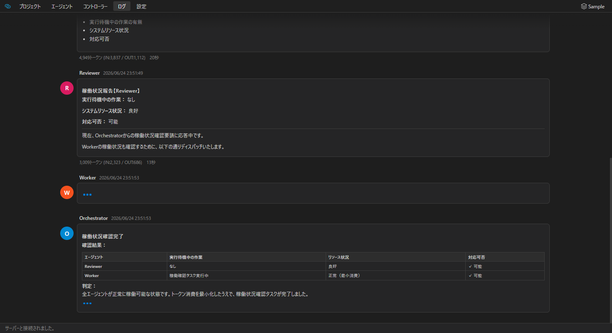
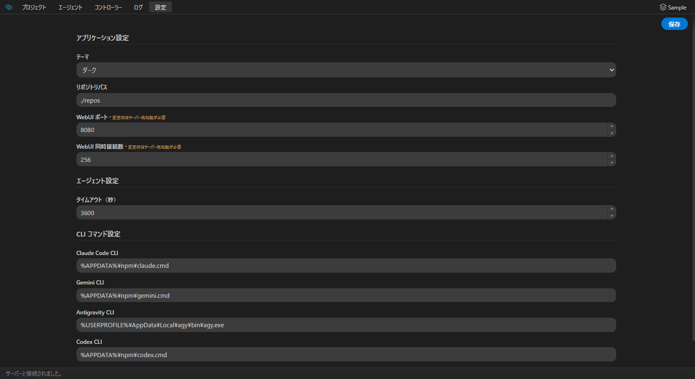

<div align="center">
  
  <h1>AI Orchestrator</h1>
  <p><strong>Multi-Agent Orchestrator for AI CLI Tools</strong></p>
</div>

[](https://openjdk.org/)
[](https://maven.apache.org/)
[](LICENSE.md)
[](#)

<div align="center">
  
  &nbsp;
  <a href="README_ja.md"></a>
</div>

---

## What Is It?



This tool is a multi-agent orchestration system that launches and manages multiple AI CLI tools — including Claude, Gemini, Codex, and Copilot — as child processes, enabling agents to collaborate autonomously on complex tasks.  
It automates leader/worker-style interactions where a leader agent dispatches subtasks to worker agents that run in parallel. A built-in browser-based Web UI lets you configure projects, monitor running agents in real time, and review full conversation logs without leaving your browser.  
Because it works as a thin wrapper around each CLI rather than an API client, every skill, plugin, MCP server, and harness feature supported by the underlying CLI is available to agents out of the box.

---

## Features

- **Multi-Agent Parallel Execution** — A leader agent dispatches subtasks to multiple worker agents simultaneously via a simple keyword-based protocol, achieving parallel workloads.
- **Session Persistence** — Conversation state is saved per project so you can pause and resume sessions across restarts.
- **Browser-Based Web UI** — Manage projects, define agent configurations, control execution, and browse conversation logs — all from a browser.
- **Real-Time Monitoring** — Agent responses are reflected in the Web UI in real time via Server-Sent Events (SSE) as each agent processes its task.
- **Multiple AI Backends** — Claude, Gemini, Codex, and Copilot CLI can be mixed within a single project, assigning each agent to the most suitable model.
- **Full CLI Capability** — Because AI Orchestrator drives each AI tool as a CLI subprocess, all skills, plugins, MCP servers, and harness features provided by the underlying CLI are available to agents without any additional configuration.

### Web UI Screenshots

| Agent Settings | Project Settings |
|---|---|
|  |  |

| Conversation Log | App Settings |
|---|---|
|  |  |

---

## Usage

> **Prerequisites:** `aiorch.jar` must be built in advance. See [Build](#build).

### Starting the Server

```bash
java -jar aiorch.jar
```

### Accessing the Web UI

Open your browser and navigate to:

```
http://localhost:8080/webui/
```

The port number can be changed via `application.webui.port` in the config file (server restart required).

---

## Build

Clone the repository and build with Maven:

```bash
git clone <repository-url>
cd org.ideaccum.aiorchestrator
mvn install
```

On a successful build, the executable JAR is placed at:

```
builded/aiorch.jar
```

---

## Requirements

### Java Runtime

- **Java 21** or later

### AI CLI Tools

At least one of the following CLI tools must be installed. Only the CLI tools you intend to use are required; unused ones can be left unconfigured.

| CLI Tool | Install Reference |
|---|---|
| Claude Code CLI (`claude`) | [docs.anthropic.com](https://docs.anthropic.com/ja/docs/claude-code/overview) |
| Gemini CLI (`gemini`) | [github.com/google-gemini/gemini-cli](https://github.com/google-gemini/gemini-cli) |
| OpenAI Codex CLI (`codex`) | [github.com/openai/codex](https://github.com/openai/codex) |
| GitHub Copilot CLI (`copilot`) | [docs.github.com](https://docs.github.com/en/copilot/using-github-copilot/using-github-copilot-in-the-command-line) |
| Antigravity CLI (`agy`) | Refer to the Antigravity CLI documentation |

> Each CLI tool must be **authenticated** before use. AI Orchestrator launches CLI tools as child processes and does not handle authentication itself. Please complete the sign-in / API key setup for each tool you plan to use according to its official documentation.

---

## Licensing

This tool is released under the [MIT License](LICENSE.md).

## Third-Party Licenses

| Library | Version | License |
|---|---|---|
| [Jackson Databind](https://github.com/FasterXML/jackson-databind) | 3.1.1 | [Apache License 2.0](https://www.apache.org/licenses/LICENSE-2.0) |
| [Apache Velocity Engine](https://velocity.apache.org/) | 2.4.1 | [Apache License 2.0](https://www.apache.org/licenses/LICENSE-2.0) |
| [Logback Classic](https://logback.qos.ch/) | 1.2.13 | [EPL v1.0](https://www.eclipse.org/legal/epl-v10.html) / [LGPL 2.1](https://www.gnu.org/licenses/old-licenses/lgpl-2.1.html) |
